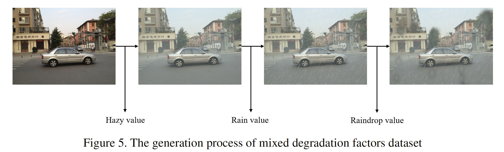

# Task_Adaptive_Network

The code of generating dataset with mix degradation factors and training Task Adaptive Network .

We construct a mixed degradation factors dataset that combines three degradation factors of rain, haze, and raindrop. And to deal with this problem, We propose a task-adaptive attention module to enable the network to restore images with multiple degradation factors. 

Zhou J, Leong C, Lin M, et al. [Task Adaptive Network for Image Restoration with Combined Degradation Factors](https://openaccess.thecvf.com/content/WACV2022W/VAQ/html/Zhou_Task_Adaptive_Network_for_Image_Restoration_With_Combined_Degradation_Factors_WACVW_2022_paper.html)[C]//Proceedings of the IEEE/CVF Winter Conference on Applications of Computer Vision. 2022: 1-8.
